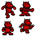

# EriksonDinossauro.github.io

# eriksonnicacio.github.io
 ---
layout: default
---

Text can be **minha**, _pagina_, or ~~principal~~.
# Quem sou eu!?
Aluno de Programação de Jogos Digitais, Eikson Pedro.

* * * 
# Portifólio 

* * *  
## Games  
1. piramid escape  
[express manesage](https://eriksonnicacio.github.io/New%20project/)

2. Bacteria  
[Bacteria](https://eriksonnicacio.github.io/bacteria2/)

3. piramid escape  
[Pyramid Escape](https://jldifrn.github.io/PyramidEscape/)  
* * *  
## Artes 
                        

* * *  
## Projetos  
* Protótipo de controle de acesso via identificação por rádio frequência com base na plataforma arduino
 
***
## Parceiros
[Victor](https://victor-mesmo.github.io/)

[Jose Luiz](https://jldifrn.github.io/)

[Elielton](https://elielton90.github.io/)
* * *  
**negrito  
_ itálico  
~~ riscado  

#s uma ou mais" # " criam capitulos e subcap

* * *  
